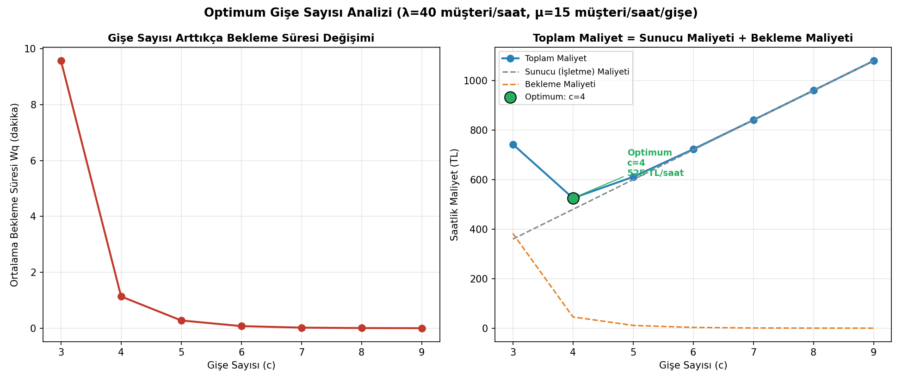
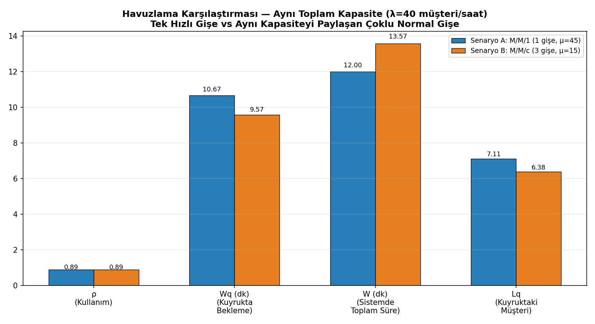
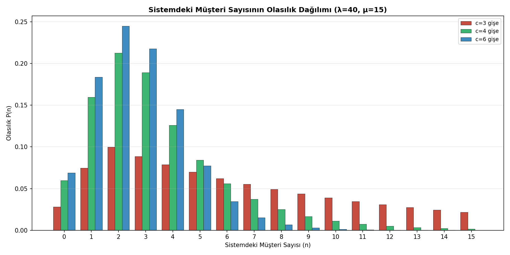

# kuyruk-teorisi-analizi

M/M/1 ve M/M/c (Erlang-C) analitik kuyruk modelleri ile havuzlama karşılaştırması ve maliyet tabanlı optimum sunucu sayısı analizi

## Açıklama

Bu proje, kuyruk teorisinin temel modelleri olan **M/M/1** ve **M/M/c**'yi
kapalı-form (analitik) formüllerle sıfırdan uygular ve iki gerçekçi karar
problemine cevap arar:

1. **Havuzlama (Pooling):** Aynı toplam hizmet kapasitesine sahip **tek hızlı
   bir gişe** mi, yoksa **kapasiteyi paylaşan birden fazla normal gişe** mi
   daha iyi performans verir?
2. **Optimum Kapasite:** Bir hizmet sisteminde, artan gişe sayısı bekleme
   maliyetini azaltırken işletme maliyetini artırır — toplam maliyeti
   minimize eden **optimum gişe sayısı** kaçtır?

## Yöntem

### M/M/c Genel Formülleri (c=1 için M/M/1'e indirgenir)

```
a = λ/μ            (sunulan yük, Erlang)
ρ = a/c            (sunucu başına kullanım oranı, kararlılık için ρ<1 şart)

P0 = [ Σ_{n=0}^{c-1} (aⁿ/n!) + (a^c/c!)·(1/(1-ρ)) ]⁻¹        (boş sistem olasılığı)

P_bekle = (a^c / (c!·(1-ρ))) · P0                              (Erlang-C: bekleme olasılığı)

Lq = P_bekle · ρ/(1-ρ)          Wq = Lq / λ                    (kuyruk uzunluğu / bekleme süresi)
L  = Lq + a                     W  = Wq + 1/μ                  (sistemdeki toplam / toplam süre)
```

### Analiz 1 — Havuzlama Karşılaştırması

Aynı toplam kapasiteyi (45 müşteri/saat) sağlayan iki farklı tasarım,
aynı talep (λ=40 müşteri/saat) altında karşılaştırılır:

| Senaryo | Tasarım | μ (gişe başına) | Gişe sayısı |
|---|---|---|---|
| A (M/M/1) | Tek hızlı gişe | 45 | 1 |
| B (M/M/c) | Çoklu normal gişe | 15 | 3 |

### Analiz 2 — Optimum Gişe Sayısı

```
Toplam Maliyet(c) = c · C_sunucu + C_bekleme · Lq(c)
```

`C_sunucu` (gişe başına saatlik işletme maliyeti) ve `C_bekleme` (kuyrukta
bekleyen bir müşterinin saatlik maliyeti) verildiğinde, `c` üzerinde tarama
yapılarak toplam maliyeti minimize eden gişe sayısı bulunur.

## Kurulum

```bash
git clone https://github.com/burakefearslanturk/kuyruk-teorisi-analizi.git
cd kuyruk-teorisi-analizi
pip install -r requirements.txt
```

## Kullanım

```bash
# Tam çalıştırma: her iki analiz + 3 görsel
python ana_program.py

# Sadece M/M/1 ve M/M/c formüllerini test etmek için
python kuyruk_modelleri.py
```

## Örnek Sonuçlar

### Havuzlama Karşılaştırması (λ=40 müşteri/saat)

| Metrik | A: M/M/1 (1 gişe, μ=45) | B: M/M/c (3 gişe, μ=15) |
|---|---|---|
| Kullanım (ρ) | 0.889 | 0.889 |
| Kuyrukta bekleme (Wq) | **10.67 dk** | **9.57 dk** ✓ daha iyi |
| Sistemde toplam süre (W) | **12.00 dk** ✓ daha iyi | **13.57 dk** |
| Kuyruktaki müşteri (Lq) | 7.11 | 6.38 |

> **Önemli çıkarım:** Çoklu gişe (havuzlama), kuyrukta bekleme süresini
> (Wq) azaltır — çünkü tüm gişelerin aynı anda dolu olma ihtimali, tek
> bir gişenin meşgul olma ihtimalinden istatistiksel olarak daha düşüktür.
> Ancak sistemde **toplam** geçirilen süre (W) daha kötüdür, çünkü her bir
> gişenin hizmet hızı (μ=15) tek hızlı gişeden (μ=45) çok daha yavaştır —
> hizmetin kendisi 3 kat daha uzun sürer. Bu, "daha fazla ama yavaş sunucu"
> ile "tek ama hızlı sunucu" arasındaki klasik ödünleşimi somutlaştırır.

### Optimum Gişe Sayısı (λ=40, μ=15, C_sunucu=120 TL/s, C_bekleme=60 TL/s)

| Gişe | ρ | Lq | Wq (dk) | Sunucu Mly. | Bekleme Mly. | **Toplam** |
|---|---|---|---|---|---|---|
| 3 | 0.889 | 6.380 | 9.57 | 360 | 383 | 743 |
| **4** | **0.667** | **0.757** | **1.14** | **480** | **45** | **★ 525** |
| 5 | 0.533 | 0.185 | 0.28 | 600 | 11 | 611 |
| 6 | 0.444 | 0.050 | 0.07 | 720 | 3 | 723 |

**Optimum: 4 gişe** — daha az gişede bekleme maliyeti patlıyor, daha fazla
gişede boşa harcanan kapasite maliyeti artıyor; ikisinin kesiştiği nokta
minimum toplam maliyeti veriyor.

## Görselleştirmeler

Program çalıştırıldığında proje kök dizinine (README.md ile aynı yere)
üç grafik kaydedilir:

### 1) Optimum Gişe Sayısı Analizi



Sol: gişe sayısı arttıkça bekleme süresinin (Wq) nasıl hızla düştüğü. Sağ:
sunucu maliyeti (artan) ile bekleme maliyeti (azalan) eğrilerinin toplamı
olan U şeklindeki toplam maliyet eğrisi; optimum nokta yeşil ile işaretlenir.

### 2) Havuzlama Karşılaştırması



Tek hızlı gişe (M/M/1) ile aynı toplam kapasiteyi paylaşan çoklu normal
gişenin (M/M/c) dört temel metrikte (ρ, Wq, W, Lq) karşılaştırması.

### 3) Sistem Dağılımı



Farklı gişe sayıları (3, 4, 6) için sistemdeki müşteri sayısının olasılık
dağılımı — gişe sayısı arttıkça dağılımın düşük değerlere nasıl yığıldığı
(daha az kalabalık sistem) görsel olarak karşılaştırılır.

## Klasör Yapısı

```
kuyruk-teorisi-analizi/
├── veri.py                       # Sistem parametreleri, senaryolar, maliyet katsayıları
├── kuyruk_modelleri.py            # M/M/1, M/M/c (Erlang-C), P(n) dağılımı, maliyet formülleri
├── gorsellestirme.py              # 3 görselin üretimi
├── ana_program.py                 # Tüm analizleri çalıştıran ana script
├── sunucu_sayisi_analizi.png      # Üretilen görsel (README'de kullanılır)
├── havuzlama_karsilastirma.png    # Üretilen görsel (README'de kullanılır)
├── sistem_dagilimi.png            # Üretilen görsel (README'de kullanılır)
├── requirements.txt
└── README.md
```

> Görseller ayrı bir alt klasörde DEĞİL, README.md ile aynı kök dizinde
> tutulur — bu sayede GitHub'a yüklerken klasör yapısı karışıklığı
> yaşanmaz ve `` gibi göreli bağlantılar
> sorunsuz çalışır.

## Kendi Sisteminizle Kullanım

`veri.py` dosyasındaki λ, μ, gişe sayısı aralığı ve maliyet katsayılarını
kendi sisteminizin verileriyle değiştirmeniz yeterlidir. `ρ = λ/(cμ) ≥ 1`
olduğu durumlarda sistem kararsızdır (kuyruk sınırsız büyür); kod bu durumu
otomatik olarak tespit edip bildirir.

## Ekip

| Ad Soyad | Katkı / Görev | GitHub |
|---|---|---|
| Burak Efe Arslantürk | Kuyruk modellerinin (M/M/1, M/M/c) matematiksel formüllerinin uygulanması, Erlang-C hesaplamalarının doğrulanması | [@burakefearslanturk](https://github.com/burakefearslanturk) |
| Ceren Gündüz | Depo kurulumu, README dosyasının hazırlanması, görselleştirmelerin depoya entegrasyonu | [@cerengunduz](https://github.com/cerengunduz) |
| Şevval Bengü Gündüz | Maliyet optimizasyonu senaryolarının tasarlanması, optimum gişe sayısı analizinin test edilmesi | [@sevvalbengu](https://github.com/sevvalbengu) |

## Lisans

MIT
